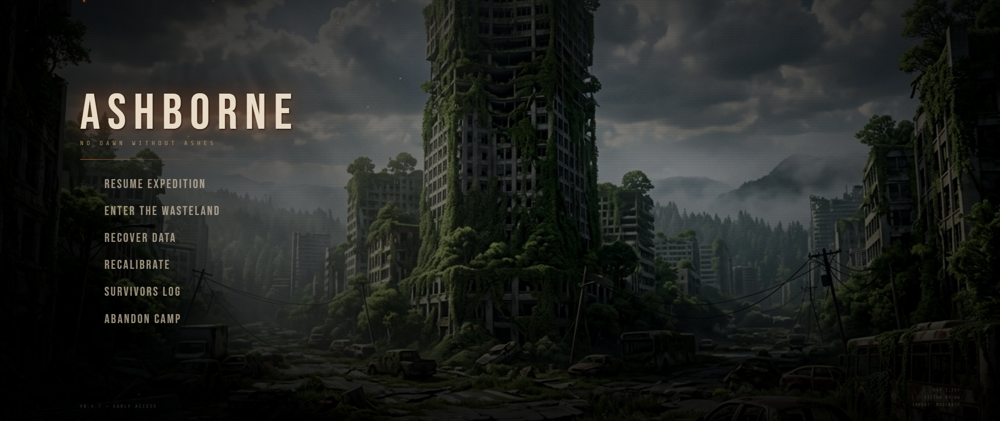

# ASHBORNE — Post-Apocalyptic Game Main Menu

A cinematic, single-screen main menu concept for a post-apocalyptic game — built entirely with vanilla HTML, CSS, and JavaScript.



---

## Features

- **Fire ember particles** — 90 lightweight canvas particles with glow, wobble physics, and fade lifecycle, all driven by GSAP
- **Cinematic intro** — background zoom, title fade, divider wipe, and staggered menu entrance on page load
- **Smooth hover effects** — per-item highlight, label shift, diamond marker, and hotkey reveal, all animated via GSAP (no CSS transitions)
- **Slow background parallax** — subtle infinite pan using GSAP yoyo loop
- **Atmospheric overlays** — vignette, scanline grid, and color grading via CSS filters
- **Post-apocalyptic copy** — contextual labels, sector info, threat level, and survival day counter

---

## Stack

| Tool | Purpose |
|---|---|
| HTML / CSS | Layout, overlays, typography |
| Canvas API | Particle rendering |
| [GSAP 3](https://gsap.com/) | All animations — particles, intro, hover, parallax |
| Google Fonts | Bebas Neue + Share Tech Mono |

No frameworks. No build tools. One file.

---

## Getting Started

```bash
git clone https://github.com/constafix/postapocalyptic-game-menu.git
cd postapocalyptic-game-menu
```

Open `index.html` in any modern browser — no server required.

---

## Structure

```
/
├── index.html       # Everything — markup, styles, and scripts
└── background.png   # Background image
```

---

## Design Notes

Particles spawn at the bottom of the screen and rise steadily at a constant rate — no bursts, no clustering. Each particle has an independent wobble amplitude, drift, and lifecycle managed through individual GSAP tweens. Hover state on menu items kills any in-flight tweens before starting new ones, preventing visual artifacts from rapid mouse movement.

The color palette is deliberately desaturated — warm amber and ash tones against a muted green ruin — to reinforce a world that's been burning for a long time.
